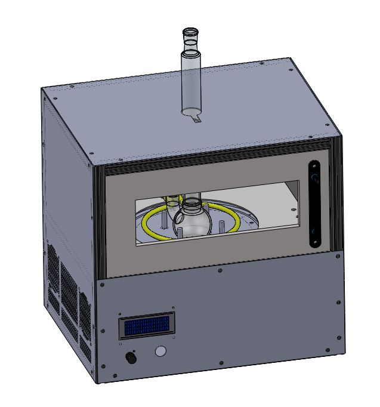
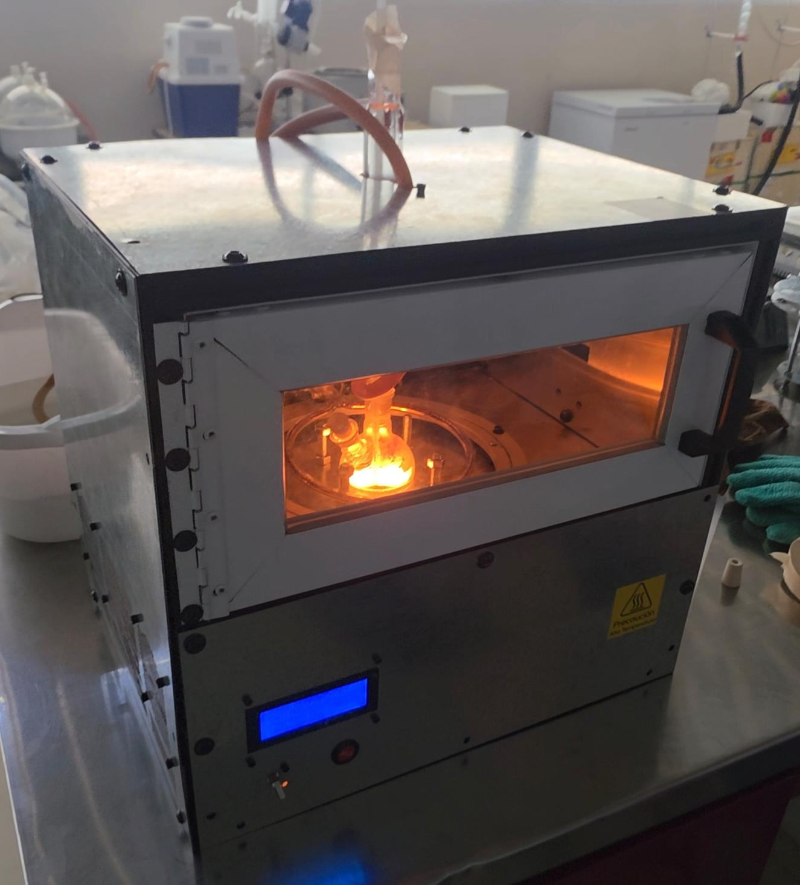
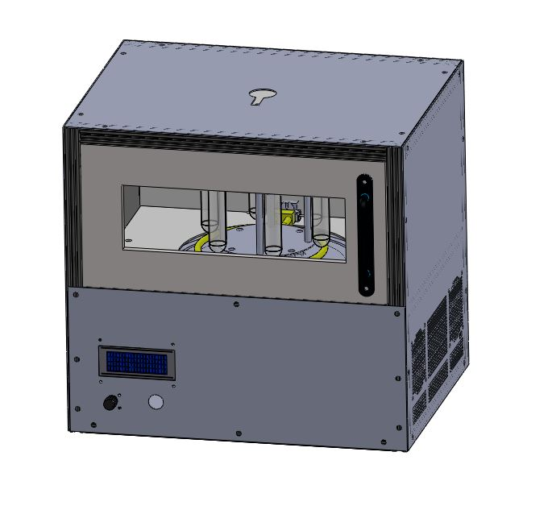
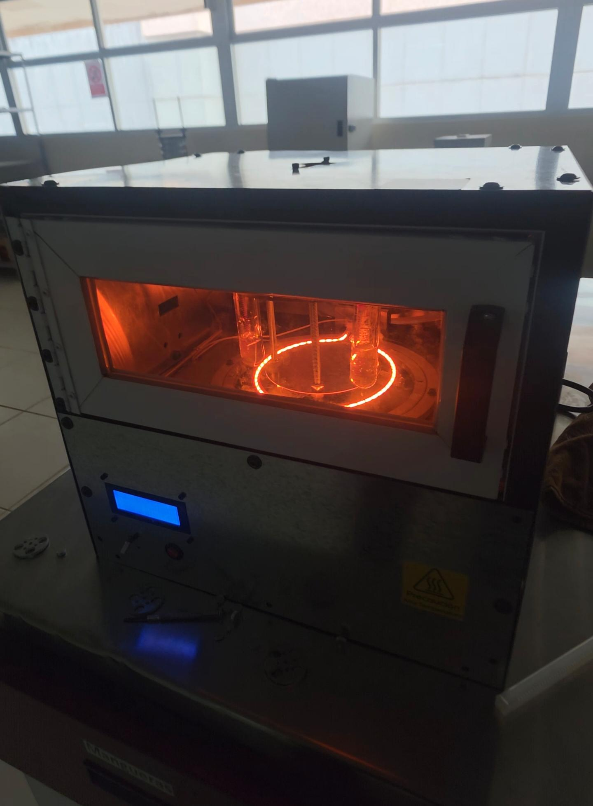

# EMARI: Extractor de Metabolitos Asistido por Radiación Infrarroja

An RTOS-driven, fuzzy-logic-controlled mechatronic prototype designed for precise, automated chemical extraction utilizing infrared-assisted radiation and dual-motor physical agitation.

---

## System Overview

To develop this prototype, a complete mechatronic design methodology was implemented, successfully bridging virtual CAD optimization with real-world physical deployment. 

The EMARI system integrates custom mechanical design, power electronics, and intelligent firmware to solve non-linear thermodynamic control challenges in metabolic extraction. By replacing traditional rule-based controllers with an adaptive control layer, the system maintains ultra-precise thermal profiles under severe physical resource constraints.

---

## Operational Configurations

The mechanical chassis and control firmware were engineered to be modular, supporting two distinct extraction methodologies. The system dynamically adapts its FreeRTOS task handling and fuzzy logic parameters based on the selected physical setup.

| Configuration | 3D CAD Design | Physical Prototype |
| :--- | :---: | :---: |
| **Mode A: Continuous Reflux**<br><br>Utilizes a central boiling flask coupled with a vertical condenser column. Optimized for exhaustive, large-volume extraction.<br><br>*Firmware Profile:* Configured for high thermal mass; maintains steady, continuous agitation to prevent localized solvent boiling. |  |  |
| **Mode B: Parallel Micro-Extraction**<br><br>Utilizes a custom rotary carousel holding individual test tubes directly exposed to the infrared radiation.<br><br>*Firmware Profile:* Rapid-response profile for low thermal mass; features precise, intermittent orbital shaking. |  |  |

> **Firmware Adaptability Note:** The ESP32 utilizes an internal state-machine to swap between the specific thermal optimization profiles and motor scaling limits required for the structural physics of Configuration A versus Configuration B.

---

## Hardware & Electromechanical Architecture

The prototype is built around a centralized control unit interfacing with industrial-grade sensing and high-torque mechanical actuation, deeply insulated to minimize thermal dissipation.

*   **Microcontroller:** ESP32-S3 (Dual-core Xtensa LX7, running at 240 MHz).
*   **Thermal Insulation:** High-density **ceramic fiber** insulation to optimize thermodynamic efficiency and protect structural integrity against extreme infrared exposure.
*   **Actuation:** Dual integrated BLDC motors managing mechanical mechanism speeds and orbital agitation rates.
*   **Sensors:** Industrial **PT100** and **LM35** temperature sensors for real-time thermal monitoring.
*   **Protocols:** SPI (for high-accuracy sensor amplifier polling) and I2C/UART for secondary data buses.

---

## Software & Firmware Architecture

The firmware is written in bare-metal **C/C++** and engineered to handle concurrent, deterministic tasks without thread blocking.

### 1. FreeRTOS Task Scheduling
To govern multiple physical subsystems concurrently, the firmware utilizes **FreeRTOS** to break execution down into isolated, prioritized tasks:
*   `Task_Sensor_Poll` (High Priority - Deterministic SPI/I2C reading every 10ms)
*   `Task_Fuzzy_Engine` (Medium Priority - Executes non-linear control calculations)
*   `Task_Motor_Actuate` (Medium Priority - Real-time PWM generation for dual-motor control)
*   `Task_Telemetry` (Low Priority - Streaming system states over UART)

### 2. Advanced Control: Fuzzy Logic
Instead of a static PID algorithm which struggles with non-linear thermodynamic delays, EMARI deploys a custom **Fuzzy Logic Control (Control Difuso)** engine. 
*   **Inputs:** Error ($e$) and Error Derivative ($\Delta e$) calculated from the PT100/LM35 sensor fusion.
*   **Outputs:** Real-time Duty Cycle modulation for the Infrared heating element and velocity scaling for the dual-motor mechanisms.

---

##  Repository Structure

```text
├── firmware/
│   ├── src/
│   │   ├── main.cpp            # Core FreeRTOS initialization and task allocation
│   │   ├── fuzzy_control.cpp   # Fuzzy inference engine logic and rule base
│   │   ├── motor_driver.cpp    # Low-level PWM driver for dual-motor control
│   │   └── sensor_spi.cpp      # Register-level PT100/LM35 driver code
│   └── include/                # Firmware header files
├── hardware/
│   ├── schematics/             # Circuit diagrams and power stage layouts
│   └── docs/                   # Material datasheets (Ceramic Fiber, Sensor specs)
└── images/                     # System schematics, photos, and performance plots
    ├── Micro_extraction_CAD.JPG
    ├── Micro_extraction_Physical.jpg
    ├── Reflux_CAD.JPG
    └── Reflux_Physical.jpeg
